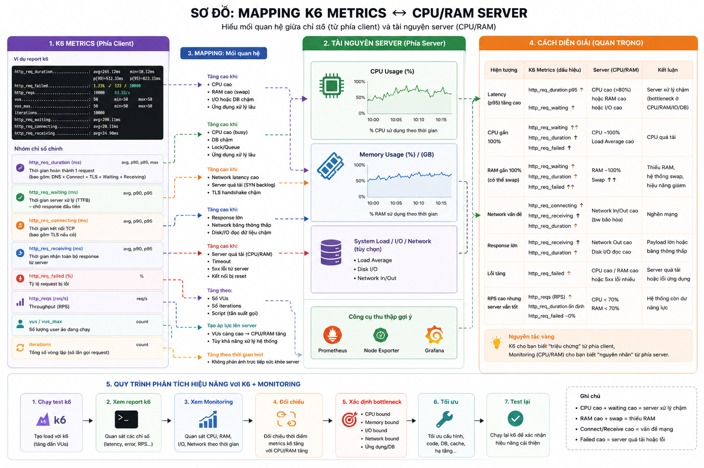

# Kiến trúc @htplus/k6-lib

> Tài liệu này giải thích kiến trúc tổng thể, cách các module tương tác, lifecycle của một bài test, và lý do cho các quyết định thiết kế.

---

## Mục lục

- [1. Tổng quan hệ thống](#1-t%E1%BB%95ng-quan-h%E1%BB%87-th%E1%BB%91ng)
- [2. Module map](#2-module-map)
- [3. Core: defineProject](#3-core-defineproject)
- [4. Module client](#4-module-client)
- [5. Module auth](#5-module-auth)
- [6. Module data](#6-module-data)
- [7. Module reporter](#7-module-reporter)
- [8. CLI Architecture](#8-cli-architecture)
- [9. Lifecycle chi tiết](#9-lifecycle-chi-ti%E1%BA%BFt)
- [10. Auth flow chi tiết](#10-auth-flow-chi-ti%E1%BA%BFt)
- [11. Dependencies](#11-dependencies)
- [12. Quy ước đặt tên](#12-quy-%C6%B0%E1%BB%9Bc-%C4%91%E1%BA%B7t-t%C3%AAn)

---

## 1. Tổng quan hệ thống

`@htplus/k6-lib` là thư viện chạy trên **k6 runtime** (JavaScript V8 engine), cung cấp lớp trừu tượng cho:

- **Giao tiếp HTTP/WebSocket** — wrapper quanh `k6/http` và `k6/ws`
- **Authentication** — đăng ký nhiều provider, quản lý token pool, tự động gắn header
- **Data loading** — load CSV, JSON, JSONL vào `SharedArray`
- **Scenario** — preset config cho các loại test (smoke, load, stress,...)
- **OpenAPI codegen** — sinh typed API client từ OpenAPI spec
- **CLI** — init workspace, gen code, build bundle, run test



### Giới hạn của k6 ảnh hưởng đến thiết kế

| Giới hạn | Hệ quả | Giải pháp |
|----------|--------|-----------|
| Mỗi VU là V8 isolate riêng | Biến toàn cục được copy, không share mutable state | Token từ `setup()` truyền qua `default(data)` |
| Init context không gọi được HTTP | Không thể login trong init | Login trong `setup()`, dùng `applySetupData()` |
| `open()` resolve relative path theo file đang chạy | Data files phải ở cạnh bundled test | Build copy data files vào dist |
| SharedArray hỗ trợ hạn chế | `.slice()` không hoạt động | Manual `for` loop |

---

## 2. Module map

Dưới đây là sơ đồ package và quan hệ giữa các module:

```
src/
├── config/          # defineProject — trái tim hệ thống
│   ├── define-project.ts
│   └── types.ts
├── client/          # HTTP + WebSocket wrapper
│   ├── rest-client.ts
│   ├── ws-client.ts
│   └── types.ts
├── auth/            # Authentication providers
│   ├── providers/   # password, oauth2, apikey, basic, bearer, jwt, hmac, custom
│   ├── registry.ts
│   └── token-pool.ts
├── data/            # Data loaders
│   ├── types.ts
│   └── shared-data-set.ts
├── scenarios/       # Scenario builder + presets
│   ├── builder.ts
│   └── presets/
│       ├── smoke.ts
│       ├── load.ts
│       ├── stress.ts
│       ├── spike.ts
│       ├── soak.ts
│       └── performance.ts
├── reporter/        # Reporting
│   └── handle-summary.ts
├── codegen/         # OpenAPI code generation
│   ├── parser.ts
│   └── generator.ts
├── helper/          # Utilities
│   ├── common.ts
│   ├── env.ts
│   └── threshold.ts
├── cli/             # CLI commands
│   ├── index.ts
│   ├── init.ts
│   ├── gen.ts
│   ├── build.ts
│   ├── run.ts
│   └── test.ts
├── index.ts         # Public exports
└── types.ts         # Shared types
```

---

## 3. Core: defineProject

### Vai trò

`defineProject()` là điểm vào duy nhất. Nó nhận `ProjectConfig`, kiểm tra tính hợp lệ, khởi tạo tất cả module, và trả về `ProjectToolkit` — object được dùng trong mọi file test.

### Input / Output

```
Input:  config (ProjectConfig)
        ├── name: string
        ├── baseURL: { default: string, [env: string]: string }
        ├── auth: { [name: string]: AuthProviderConfig }
        ├── testUsers: User[] | DataLoader
        ├── testData: { [name: string]: DataLoader }
        ├── thresholds: ThresholdPreset | Threshold[]
        ├── defaultTimeout: string
        └── websocket?: { ... }

Xử lý:
        1. Kiểm tra config (validate)
        2. Tạo RestClient với baseURL
        3. Tạo WsClient nếu có websocket config
        4. Duyệt auth providers → AuthRegistry
           - Mỗi provider → gọi register(name, provider, pool?)
        5. Duyệt testData → SharedDataSet
        6. Gắn auth applier vào RestClient
        7. Resolve thresholds

Output: toolkit (ProjectToolkit)
        ├── http: RestClient
        ├── ws: WsClient (undefined nếu không config)
        ├── auth: AuthRegistry
        ├── data: { [name: string]: SharedDataSet }
        ├── check(res, expectedStatus): boolean
        ├── extract(res, path): unknown
        ├── setup(): SetupData  (gọi trong k6 setup())
        └── applySetupData(data): void (gọi trong default())
```

### Toolkit methods quan trọng

#### `setup()` → `runSetup()`

1. Duyệt tất cả provider trong registry
2. Gọi `buildPoolEntries()` — login từng user qua HTTP, lưu token
3. Trả về `SetupData { pools: { [providerName]: string[] } }`

#### `applySetupData(data)`

1. Nhận `SetupData` từ `default(data)`
2. Duyệt từng pool trong `data.pools`
3. Gọi `TokenPool.load(entries)` để copy token vào pool local của VU

---

## 4. Module client

### RestClient

Wrapper quanh `k6/http`, cung cấp interface typed cho HTTP methods.

```
RestClient (khởi tạo với baseURL + options)
    ├── .get<T>(path, params?, options?)
    ├── .post<T>(path, body?, options?)
    ├── .put<T>(path, body?, options?)
    ├── .patch<T>(path, body?, options?)
    ├── .del<T>(path, body?, options?)
    ├── .head<T>(path, params?, options?)
    ├── .options<T>(path, body?, options?)
    ├── .batch(requests)
    └── .raw(request)  — cho trường hợp đặc biệt
```

**Cơ chế auth tự động:**

Khi `options.auth` được truyền, `RestClient` gọi `authApplier.apply(headers, params, authName)`. AuthApplier được `defineProject` gắn vào khi khởi tạo.

**Retry:**

Retry với exponential backoff khi request thất bại (status >= 500 hoặc network error). Số lần retry và delay configurable qua options.

**Tagging:**

Mỗi request được gắn tags: `service`, `endpoint`, `method`, `env` — dùng cho metric filtering trong k6.

### WsClient

Wrapper quanh `k6/ws`, dùng cho WebSocket test.

```
WsClient
    ├── .connect(url, params?, options?)
    └── .send(data)
```

Tự động gắn auth token vào connection (header hoặc query parameter).

---

## 5. Module auth

### AuthRegistry

Quản lý nhiều auth provider trong một project.

```
AuthRegistry
    ├── register(name, provider, pool?)
    ├── get(name): ProviderEntry
    ├── getPool(name): TokenPool | undefined
    ├── getClient(name): IAuthProvider
    └── apply(ctx, authName): boolean
```

- `register()`: gọi khi khởi tạo project, lưu provider + pool vào Map
- `apply()`: tìm provider theo tên, lấy token từ pool, gắn vào request headers
- `getPool()` / `getClient()`: truy cập trực tiếp cho trường hợp cần custom handling

### TokenPool

Pre-login token pool, quản lý vòng đời token.

```
TokenPool
    ├── buildPoolEntries(client, provider, users): Promise<TokenEntry[]>
    │   └── Gọi trong setup(): HTTP request → login → token
    ├── load(entries: TokenEntry[]): void
    │   └── Gọi trong applySetupData(): copy token vào pool local
    ├── pick(): TokenEntry
    │   └── Round-robin hoặc random theo __VU
    └── getAllEntries(): TokenEntry[]
```

**Cơ chế pick:**

- `rotation: 'round-robin'` — dùng counter tăng dần
- `rotation: 'random'` — dùng `__VU` để lấy index

### IAuthProvider interface

Tất cả provider implement interface này:

```typescript
interface IAuthProvider {
    acquireToken(client: RestClient, user?: User): TokenEntry;
    applyToRequest(ctx: AuthContext, token: TokenEntry): void;
    refresh?(client: RestClient, token: TokenEntry, user?: User): TokenEntry;
    isExpired?(token: TokenEntry): boolean;
}
```

---

## 6. Module data

### SharedDataSet

Wrapper quanh `k6/data/SharedArray` — data được load trong init context và share giữa các VU.

```
SharedDataSet<T>
    ├── all(): T[]             — tất cả entries
    ├── random(): T            — random entry
    ├── next(): T              — round-robin
    ├── pickByVU(): T          — theo index = __VU % length
    └── length: number
```

### Data loader types

| Loader | Nguồn | Output |
|--------|-------|--------|
| `csvUsers(path)` | File CSV | `User[]` (type `{ email, password, role }`) |
| `csvData<T>(path, mapper?)` | File CSV | `T[]` (generic, mapper optional) |
| `jsonData<T>(path)` | File JSON | `T[]` |
| `jsonlData<T>(path)` | File JSONL | `T[]` |
| `inlineData<T>(arr)` | Array literal | `T[]` |

---

## 7. Module reporter

### handleSummary

Callback được k6 gọi khi test kết thúc. Sinh báo cáo ở nhiều định dạng.

```
handleSummary(data)
    ├── stdout: text summary
    ├── K6_SUMMARY_DIR/result.html: HTML dashboard
    ├── K6_SUMMARY_DIR/result.json: raw metrics
    └── K6_SUMMARY_DIR/junit.xml: JUnit for CI
```

Output directory configurable qua env `K6_SUMMARY_DIR`. Nếu không set, chỉ xuất stdout.

### Web dashboard (k6 built-in)

k6 1.0.0-rc1 có sẵn web dashboard. Kích hoạt bằng environment variables:

```
K6_WEB_DASHBOARD=true
K6_WEB_DASHBOARD_PERIOD=1s     # Cần cho test ngắn (< 30s)
K6_WEB_DASHBOARD_EXPORT=report.html  # Export HTML
```

Web dashboard export là file HTML ~160KB với biểu đồ, ưu tiên dùng hơn handleSummary HTML.

---

## 8. CLI Architecture

### Entry point

`k6-lib <command> [args] [options]`

```
k6-lib <command>
    │
    ├── init <name>
    │   └── Scaffold workspace: config.ts, .env, test-users.csv, smoke/
    │
    ├── gen [--spec=openapi.yaml]
    │   └── Parse OpenAPI → sinh generated/api.ts (typed client)
    │
    ├── build [workspace]
    │   ├── auto-discover *.test.ts trong workspace
    │   ├── webpack bundle từng file → dist/<type>/<name>.test.js
    │   └── copy data files (CSV, JSON, YAML) vào dist/
    │
    ├── run <target>
    │   ├── discover *.test.js
    │   ├── --vus, --duration, --type, --env pass-through
    │   └── K6_WEB_DASHBOARD env tự động
    │
    └── test <workspace> [type]
        ├── gen → build → run một lệnh
        ├── --skip-gen, --skip-build
        └── pass-through flags cho k6
```

### Build pipeline

```
*.test.ts (source)
    │
    ▼
webpack (config built in RAM)
    ├── entry: mỗi file test
    ├── babel-loader + @babel/preset-env + @babel/preset-typescript
    └── externals: k6, k6/http, k6/ws, k6/data, ...
    │
    ▼
dist/<type>/<name>.test.js
    │
    ▼
Copy data files: *.csv, *.json, *.yaml, *.yml
    └── dist/<type>/ (cùng thư mục với test)
```

Data files được copy vào dist vì `open()` trong k6 resolve relative path theo file đang chạy (không phải CWD).

---

## 9. Lifecycle chi tiết

### Phase 1: Init context (k6 load script)

```typescript
// Chạy 1 lần khi k6 load script
import project from '../config';          // defineProject khởi tạo registry rỗng
export const options = ScenarioBuilder... // build options
export function setup() { ... }           // setup function
```

- `defineProject()` khởi tạo toolkit
- Mỗi V8 isolate nhận bản copy riêng của tất cả global objects
- Token pool rỗng ở phase này (chưa login)

### Phase 2: Setup

```typescript
export function setup() {
    return project.setup();   // → runSetup()
}
```

```
runSetup():
    1. Duyệt auth providers từ registry
    2. Với mỗi provider:
       a. Gọi buildPoolEntries(client, provider, users)
       b. Login từng user: POST /auth/login → token
       c. Trả về TokenEntry[]
    3. Đóng gói vào SetupData { pools: { user: [...token] } }
```

- Đây là phase DUY NHẤT có thể gọi HTTP
- Login N user, lưu token entries

### Phase 3: VU execution

```typescript
export default function (data) {
    project.applySetupData(data);   // nạp token vào pool local
    project.http.post('/posts', body, { auth: 'user' });
}
```

```
default(data):
    1. applySetupData(data):
       a. Duyệt data.pools
       b. Mỗi pool → pool.load(entries)
       c. TokenPool local có entries sẵn sàng
    2. project.http.post(..., { auth: 'user' }):
       a. RestClient.buildHeaders() gọi authApplier
       b. AuthRegistry.apply(ctx, 'user')
       c. TokenPool.pick() → token
       d. IAuthProvider.applyToRequest(ctx, token)
       e. Header 'Authorization: Bearer <token>' được gắn
       f. HTTP request được gửi
```

### Phase 4: Teardown + Report

```
Teardown (nếu có): k6 gọi teardown()
Report: handleSummary(data) → stdout + file export
```

---

## 10. Auth flow chi tiết

### Request flow

```
VU: project.http.post('/posts', { title: 'test' }, { auth: 'user' })
                     │
                     ▼
    1. RestClient.post()
        ├── Tạo request config với URL, body, params
        ├── Gọi buildHeaders(params, options)
        │   ├── options.auth = 'user'
        │   └── authApplier.apply(headers, params, 'user')
        │       │
        │       ▼
        │   2. AuthRegistry.apply(ctx, 'user')
        │       ├── entries.get('user') → ProviderEntry
        │       │   ├── provider: PasswordAuthProvider
        │       │   └── pool: TokenPool (loaded từ setupData)
        │       ├── getToken('user')
        │       │   └── pool.pick()
        │       │       ├── entries.length > 0 ?
        │       │       ├── rotation === 'round-robin'
        │       │       │   └── index = counter++ % length
        │       │       └── return token
        │       ├── provider.applyToRequest(ctx, token)
        │       │   └── ctx.headers['Authorization'] = 'Bearer <token>'
        │       └── return true
        │
        ├── 3. auth headers đã được gắn
        └── 4. HTTP.request(method, url, body, params)
                     │
                     ▼
             Request được gửi với Authorization header
```

### Vì sao cần applySetupData?

Đây là vấn đề cốt lõi của k6 architecture:

1. k6 tạo **V8 isolate riêng** cho mỗi VU
2. Mỗi isolate có bản copy riêng của tất cả objects khởi tạo trong init context
3. `setup()` chạy trong **setup isolate** — login và lưu token vào pool của isolate đó
4. VU isolate nhận được **bản copy** của AuthRegistry, nhưng pool bên trong vẫn rỗng

Giải pháp: `applySetupData()` là cầu nối.
- `setup()` trả về `SetupData` (plain object: pools mapping provider → token array)
- k6 truyền object này vào `default(data)` cho mỗi VU
- `applySetupData()` ở đầu `default()` đọc `data.pools` và gọi `pool.load(entries)` để copy token vào pool local

## 11. Dependencies

### Runtime

| Package | Dùng cho |
|---------|----------|
| `k6` | Runtime environment (type definitions) |
| `js-yaml` | Parse YAML data files |
| `dotenv` | Load `.env` file |

### Build

| Package | Dùng cho |
|---------|----------|
| `typescript` | TypeScript compiler |
| `webpack` | Bundle test files |
| `babel-loader` | Transpile JS trong webpack |
| `@babel/preset-env` | Target ES modules cho k6 |
| `@babel/preset-typescript` | TypeScript → JS trong webpack |

## 12. Quy ước đặt tên

| Thành phần | Quy tắc |
|------------|---------|
| Workspace | `workspaces/<tên-dự-án>/` |
| Config | `config.ts` (export default defineProject) |
| Test files | `<folder>/<name>.test.ts` |
| Test types | `smoke/`, `load/`, `stress/`, `spike/`, `soak/`, `performance/` |
| OpenAPI spec | `openapi.yaml` hoặc `openapi.json` |
| Generated | `generated/api.ts` |
| Data files | `data/*.csv`, `data/*.json` |
| Bundled output | `dist/<type>/<name>.test.js` |
| Report output | `reports/<type>/<name>_<timestamp>/` |
