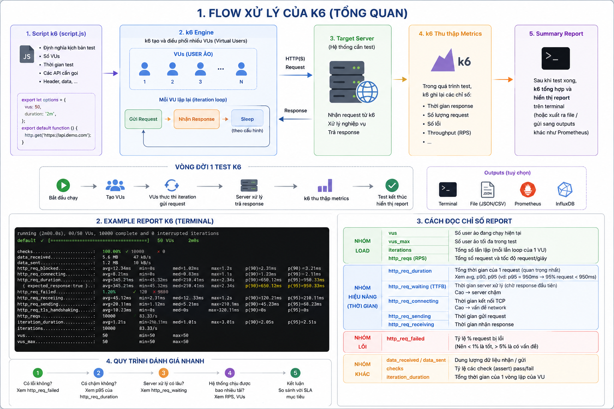
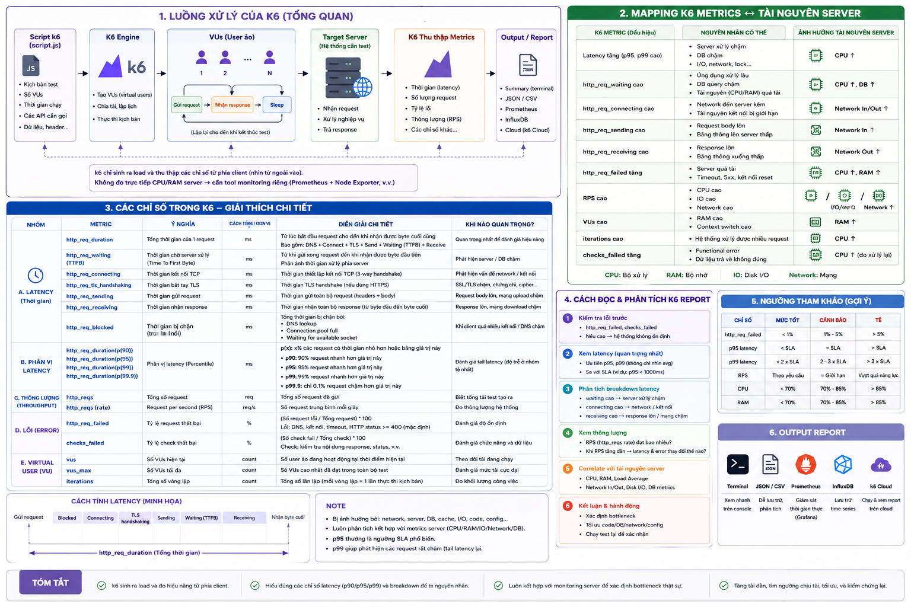
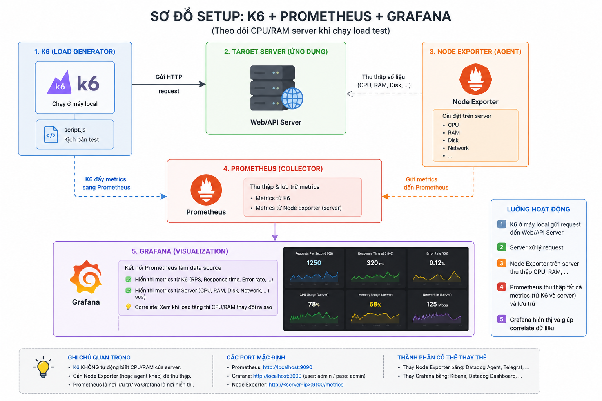

# @htplus/k6-lib

**k6 performance testing framework** — REST + WebSocket, đa auth, OpenAPI codegen, CLI tích hợp.



---

## Mục lục

- [1. Giới thiệu](#1-gi%E1%BB%9Bi-thi%E1%BB%87u)
- [2. Cài đặt & Yêu cầu](#2-c%C3%A0i-%C4%91%E1%BA%B7t--y%C3%AAu-c%E1%BA%A7u)
- [3. Quick Start](#3-quick-start)
- [4. Cấu trúc workspace](#4-c%E1%BA%A5u-tr%C3%BAc-workspace)
- [5. Định nghĩa project](#5-%C4%91%E1%BB%8Bnh-ngh%C4%A9a-project)
- [6. Viết test](#6-vi%E1%BA%BFt-test)
- [7. Build & Run](#7-build--run)
- [8. Auth providers](#8-auth-providers)
- [9. Data loaders](#9-data-loaders)
- [10. Thresholds](#10-thresholds)
- [11. Reporting](#11-reporting)
- [12. CLI commands](#12-cli-commands)
- [13. Vòng đời test](#13-v%C3%B2ng-%C4%91%E1%BB%9Di-test)

---

## 1. Giới thiệu

`@htplus/k6-lib` là thư viện chuẩn hóa việc viết k6 performance test. Thay vì mỗi dự án tự xây dựng cấu trúc, auth, data loading riêng, thư viện cung cấp:

- **defineProject()** — config tập trung, tự động tạo HTTP/WS client kèm auth
- **Auth registry** — đăng ký nhiều provider (password, OAuth2, API key, ...) trong một project
- **Token pool** — pre-login N user ở `setup()`, phân phối token round-robin cho VUs
- **Scenario builder** — presets cho smoke, load, stress, spike, soak, performance
- **OpenAPI codegen** — sinh typed API client từ spec
- **CLI đa năng** — init, gen, build, run, test — một công cụ cho mọi workspace
- **Web dashboard** — HTML report ~160KB với biểu đồ real-time

## 2. Cài đặt & Yêu cầu

**Yêu cầu:**
- Node.js >= 18
- k6 >= 1.0.0-rc1 (`brew install k6`)

**Cài đặt:**

```bash
git clone <repo>
cd k6-lib
npm install
npm run build
```

## 3. Quick Start

Tạo workspace mới và chạy test trong 3 bước:

**Bước 1: Tạo project**

```bash
k6-lib init my-project
```

Lệnh này sinh cấu trúc thư mục `workspaces/my-project/` với các file config mẫu.

**Bước 2: Viết config và test**

Sửa `workspaces/my-project/config.ts` để chỉnh base URL, auth, users. Đặt file test vào `smoke/`, `load/`, ...

**Bước 3: Build và chạy**

```bash
k6-lib test workspaces/my-project smoke --vus 1 --duration 10s
```

Một lệnh duy nhất: codegen (nếu có OpenAPI spec) → webpack build → k6 run.

Xem kết quả tại `workspaces/my-project/reports/smoke/`.

---

Nếu đã có sẵn workspace (ví dụ `project_example`), bỏ qua bước 1:

```bash
k6-lib test workspaces/project_example smoke --vus 1 --duration 10s
```

## 4. Cấu trúc workspace

```
workspaces/<tên-dự-án>/
├── config.ts             # defineProject — cấu hình trung tâm
├── openapi.yaml          # OpenAPI spec (tùy chọn, cho codegen)
├── .env                  # BASE_URL, credentials
├── test-users.csv        # Danh sách user cho auth pool
├── data/                 # Test data (JSON, CSV)
│   ├── posts.json
│   └── comments.csv
├── generated/
│   └── api.ts            # Codegen từ OpenAPI (tự động sinh)
├── smoke/
│   └── post.test.ts      # Smoke test: 5 VUs, 1 phút
├── load/
│   └── post.test.ts      # Load test: 50 VUs, 10 phút
├── stress/
│   └── post.test.ts      # Stress test: ramp up 200 VUs
├── spike/
├── soak/
└── performance/
```

Mỗi thư mục test type (`smoke/`, `load/`, ...) chứa `*.test.ts` — tự động được CLI phát hiện và bundle.

## 5. Định nghĩa project

`config.ts` là nơi khai báo mọi thứ: base URL, auth, users, data, thresholds.

```typescript
import { defineProject, passwordAuth, csvUsers, jsonData, env } from '@htplus/k6-lib';

export default defineProject({
    name: 'project_example',
    baseURL: {
        default: env('BASE_URL', 'http://localhost:3000'),
        staging: 'https://staging.example.com',
    },
    auth: {
        user: passwordAuth({
            loginPath: '/auth/login',
            body: (u) => ({ email: u.email, password: u.password }),
            extractToken: 'data.token',
            pool: { size: 10, rotation: 'round-robin' },
        }),
    },
    testUsers: csvUsers('./test-users.csv'),
    testData: {
        posts: jsonData('./data/posts.json'),
    },
    thresholds: 'api',
    defaultTimeout: '30s',
});
```

Sau khi gọi `defineProject()`, bạn nhận được **ProjectToolkit** — object trung tâm dùng trong mọi file test:

| Method | Chức năng |
|--------|-----------|
| `project.http` | REST client (GET, POST, PUT, PATCH, DELETE) |
| `project.ws` | WebSocket client |
| `project.auth` | Auth registry — quản lý provider và token pool |
| `project.data` | Test data loader (CSV, JSON, ...) |
| `project.check(res, expectedStatus)` | Kiểm tra HTTP status |
| `project.extract(res, path)` | Trích xuất field từ JSON response |
| `project.setup()` | Pre-login token pool (gọi trong `setup()`) |
| `project.applySetupData(data)` | Nạp token từ setup vào VU isolate (gọi đầu `default()`) |

### Môi trường (environments)

Dùng tham số `--env` để chọn base URL:

```bash
k6-lib test workspaces/project_example smoke --env staging
```

Config cần khai báo `baseURL.staging` tương ứng. Nếu không truyền `--env`, mặc định dùng `baseURL.default`.

## 6. Viết test

### 6.1. HTTP test cơ bản

```typescript
// smoke/post.test.ts
import { group } from 'k6';
import { ScenarioBuilder, defaultScenarioOptions, createThresholds, createTrend, SetupData } from '@htplus/k6-lib';
import { randomSleep } from '@helper/common';
import project from '../config';
export { handleSummary } from '@reporter';

export function setup() { return project.setup(); }

const trend = createTrend('api_duration_ms');

export const options = ScenarioBuilder.smoke(5, '1m')
    .setThresholds(createThresholds({ 'api_duration_ms': ['p(95)<1000'] }))
    .setGlobalOptions(defaultScenarioOptions)
    .build();

export default function (data: unknown) {
    project.applySetupData(data as SetupData);

    group('Post CRUD', () => {
        const res = project.http.post('/posts', { title: 'test', content: 'test' }, { auth: 'user' });
        project.check(res, 201);
        trend.add(res.timings?.duration || 0);
        const id = project.extract(res, 'data.id') as number;
        if (!id) return;

        project.http.put(`/posts/${id}`, { title: 'updated', content: 'test' }, { auth: 'user' });
        project.http.del(`/posts/${id}`, null, { auth: 'user' });
    });
    randomSleep(0.5, 1);
}
```

**Giải thích luồng:**

1. `setup()` chạy trong k6 setup phase — gọi API login, lưu token vào pool
2. k6 truyền kết quả `setup()` vào `default(data)` cho mỗi VU
3. `applySetupData()` copy token từ `data` vào pool local của VU isolate
4. `project.http.post(..., { auth: 'user' })` tự động lấy token từ pool và gắn header `Authorization`

### 6.2. Dùng codegen (typed API)

Nếu workspace có `openapi.yaml`, chạy `k6-lib gen` để sinh `generated/api.ts`:

```typescript
import { createApi } from '../generated/api';
import project from '../config';

const api = createApi(project.http);

api.posts.createPost({ title: 'Test', content: 'test' }, { auth: 'user' });
api.posts.getPost(1, { auth: 'user' });
```

Các method được sinh kèm kiểu param và response từ OpenAPI spec.

### 6.3. Scenario presets

| Preset | Mục đích | Cấu hình |
|--------|----------|----------|
| `ScenarioBuilder.smoke(vus, duration)` | Kiểm tra nhanh | 5 VUs, 1 phút |
| `ScenarioBuilder.load(vus, duration)` | Tải trung bình | 50 VUs, 10 phút |
| `ScenarioBuilder.stress(stages)` | Chịu tải tăng dần | Ramp up 200 VUs |
| `ScenarioBuilder.spike(vus, duration)` | Đột biến | 500 VUs, 2 phút |
| `ScenarioBuilder.soak(vus, duration)` | Chịu tải dài | 30 VUs, 8 giờ |
| `ScenarioBuilder.performance(stages)` | Kiểm tra hiệu năng | Multi-stage |

## 7. Build & Run

### 7.1. Build (webpack bundle)

```bash
k6-lib build workspaces/project_example
```

Quá trình build:
1. Tự động tìm tất cả `*.test.ts` trong workspace
2. Bundle từng file bằng webpack + babel-loader (không cần config)
3. Copy data files (CSV, JSON, YAML) vào cùng thư mục với bundled test

Output: `workspaces/project_example/dist/<type>/<name>.test.js`

Data files được copy vào dist vì k6 `open()` resolve đường dẫn tương đối theo file đang chạy, không theo CWD.

### 7.2. Run (một lệnh)

```bash
# Chạy smoke test
k6-lib test workspaces/project_example smoke --vus 1 --duration 10s

# Chạy tất cả test types trong workspace
k6-lib test workspaces/project_example

# Chạy với môi trường staging
k6-lib test workspaces/project_example smoke --env staging

# Bỏ qua codegen / build nếu đã build rồi
k6-lib test workspaces/project_example smoke --skip-gen --skip-build
```

### 7.3. Run riêng lẻ (không qua CLI)

```bash
k6-lib build workspaces/project_example
k6 run workspaces/project_example/dist/smoke/post.test.js --vus 1 --duration 10s

# Với web dashboard
K6_WEB_DASHBOARD=true K6_WEB_DASHBOARD_EXPORT=report.html \
    k6 run workspaces/project_example/dist/smoke/post.test.js --vus 1 --duration 10s
```

## 8. Auth providers

Xem danh sách và cách dùng từng provider tại `ARCHITECTURE.md` (mục 5).

```typescript
import { passwordAuth, csvUsers } from '@htplus/k6-lib';

auth: {
    user: passwordAuth({
        loginPath: '/auth/login',
        body: (u) => ({ email: u.email, password: u.password }),
        extractToken: 'data.token',
        pool: { size: 10, rotation: 'round-robin' },
    }),
}
```

Tất cả provider đều có token pool: tự động login N user trong `setup()`, phân phối token round-robin cho VUs. Xem chi tiết cơ chế tại ARCHITECTURE.md mục 10.

## 9. Data loaders

```typescript
testData: {
    users: csvUsers('./test-users.csv'),
    posts: jsonData('./data/posts.json'),
    comments: csvData('./data/comments.csv'),
}
```

| Loại | Import | Ghi chú |
|------|--------|---------|
| CSV user | `csvUsers(path)` | Tự map email, password, role |
| CSV data | `csvData<T>(path, mapper?)` | Generic CSV → typed array |
| JSON | `jsonData<T>(path)` | File JSON |
| JSONL | `jsonlData<T>(path)` | JSON lines |
| Inline | `inlineData<T>([...])` | Khai báo trực tiếp |

Chi tiết cách hoạt động của `SharedDataSet` xem tại ARCHITECTURE.md mục 6.

## 10. Thresholds

### Presets có sẵn

| Preset | p(95) | Error rate | Phù hợp |
|--------|-------|------------|---------|
| `'api'` | < 1000ms | < 1% | REST API thông thường |
| `'strict'` | < 500ms | < 0.1% | API quan trọng, latency thấp |
| `'relaxed'` | < 2000ms | < 5% | Stress test, cho phép chậm |
| `'auth'` | < 1000ms | — | Chỉ check auth endpoint |
| `'ws'` | connect < 500ms | — | WebSocket |

### Custom threshold

```typescript
createThresholds(
    { 'my_metric': ['p(95)<500'] },
    CommonThresholdPresets.api
)
```

## 11. Reporting

### 11.1. handleSummary (mặc định)

Mỗi file test có `export { handleSummary } from '@reporter'` — tự động sinh:

- **stdout** — text summary ra console ngay khi test kết thúc
- **HTML, JSON, JUnit XML** — ghi ra file khi có biến môi trường `K6_SUMMARY_DIR`

### 11.2. Web dashboard (khuyến nghị)

k6 1.0.0-rc1 tích hợp sẵn web dashboard. Dùng HTML export để có báo cáo giàu biểu đồ:

```bash
K6_WEB_DASHBOARD=true K6_WEB_DASHBOARD_PERIOD=1s \
K6_WEB_DASHBOARD_EXPORT=workspaces/project_example/reports/report.html \
    k6 run dist/smoke/post.test.js --vus 1 --duration 10s
```

File HTML ~160KB có biểu đồ real-time, mở bằng browser:



### 11.3. Grafana

Kết nối k6 với Prometheus → Grafana để xem dashboard real-time trong lúc test chạy:



## 12. CLI commands

```
k6-lib init <name>              Tạo workspace mới (cấu trúc thư mục + file mẫu)
k6-lib gen --spec=openapi.yaml  Sinh typed API client từ OpenAPI spec
k6-lib build [workspace]        Bundle *.test.ts → dist/ bằng webpack
k6-lib run <target>             Chạy k6 test (file hoặc thư mục)
k6-lib test <workspace> [type]  Gen → Build → Run trong một lệnh
```

Tất cả command đều chấp nhận `--help` để xem hướng dẫn chi tiết.

## 13. Vòng đời test

```
config.ts → defineProject()
    → setup(): login user → token pool
    → default(data): applySetupData → VU chạy request
    → handleSummary: stdout + file reports
```

Chi tiết lifecycle và giải thích V8 isolate tại ARCHITECTURE.md mục 9-10.
